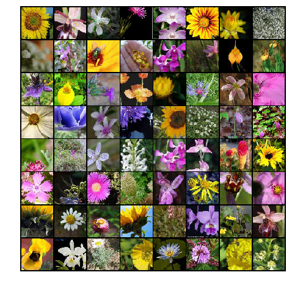
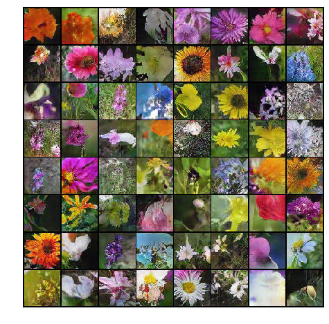
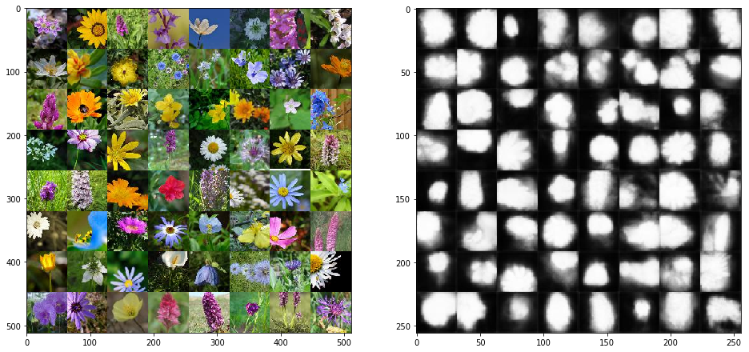
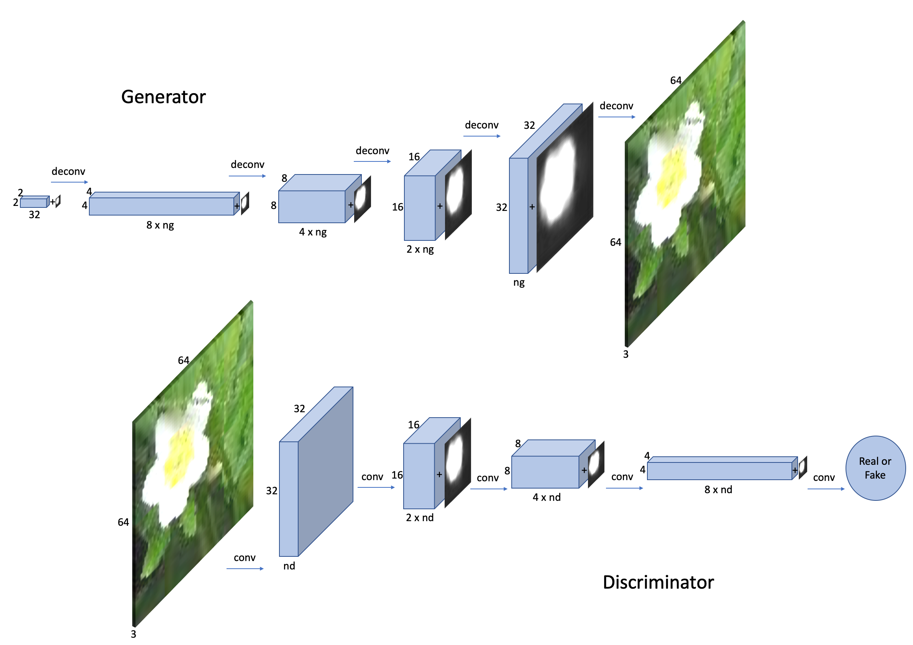
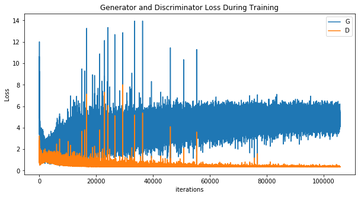
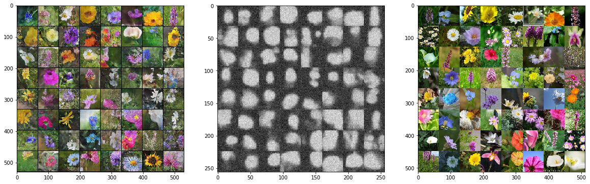

## Generative Adversarial Networks for Flowers with Location Constraint

Generative Adversarial Networks (GANs) is one of the most interesting idea in machine learning. It is able to synthesize compelling real-world images, such as faces, room interiors, cars, birds and flowers... Conditional version of GAN also allows us to specify certain condition or charactaristics of the generated images by giving the model extra input such as class labels or text discriptions. In this repository, I will build a flower generator which can generate flower images with control of the flowers' location.

[First experiment: flower generator through DCGAN](https://github.com/NoxMoon/gan_flowers/blob/master/GAN_flower.ipynb) ([deep convolutional generative adversarial networks](https://arxiv.org/abs/1511.06434)).

|Real flower images     |Generated flower images |
:-------------------------:|:-------------------------:
|| 

### Training image and masks
We initially obtained 28,865 images with bounding boxes or segmentation of flowers (from random crops of [imagenet](http://www.image-net.org) and [oxford 17flower dataset](http://www.robots.ox.ac.uk/~vgg/data/flowers/17/)). However, because a vast majority of these images have flowers in the center of the picture or occupying a large portion of the whole image, they may not be well suited to illustrate the location constraint in GAN. Thus, we trained a image segmentation model ([unet:segmentation_training.ipynb](https://github.com/NoxMoon/gan_flowers/blob/master/segmentation_training.ipynb)) with this dataset and predict on 70,637 pictures from imagenet and finally picked 27,030 images where flowers are more clearly located in a certain region.

Sample training image and corresponding masks:

### Model
We basically follow the [DCGAN](https://arxiv.org/abs/1511.06434) structure in this task. The generator starts from 32×2×2 latent space and upsamples by a series of 4×4 deconvolutions with stride 2 until reaching target image size. Relu activation is used for all intermediate layers except for the last layer, which used tanh. The discriminator downsamples by a series of 4×4 convolutions with stride 2, and uses LeakyRelu as activation for all intermediate layers. The last layer output a value between 0 and 1 through sigmoid, indicating whether the input is real or fake. To incorporate the location constraint, we concatentate the masks generated by image segmentation to different layers in both generator and discriminator. For generator, the masks are randomly sampled from existing masks in the training set. This way the model will learn the joint distribution of real image-mask pairs. The generator learns to produce real-looking images that also match the given masks. The discriminator tries to spot the fake images or images that do not satisfy the location constraint.

The GAN training is often unstable. In this case, with standard training procedure, the model collapse at around 70 epochs when the discriminator is able to 100% correctly tell apart real and fake images. To avoid this unwanted behavoir, we have to tune the hyperparameters and apply some of the suggested tricks that can stablize the training:

1. Use more filters in generator than in degenerator: ng=128, nd=64.
1. Concatenate mask to all layers in generators, but only to layers with spatial dimension 4, 8, or 16 in discriminator.
1. One-side label smoothing: use soft labels (0.9) instead of 1 for real image and masks.
1. Add instance noise: for both real and fake images, we added a gaussian noise before passing them to the degenerator, the noise level decays with epochs.
1. Add noise to masks. This also prevent the generate remembering the exact corresponding image of a certain mask.
1. Decay the learning rate with epochs.

With the above tricks, we are able to train for 250 epochs without collapse. However, we do see that the generator and discriminator losses would still diverage: over the time discriminator would finally win the game with its loss goes to zero. The tricks can only decay the collapse and allow us to obtain a more satisfying result before the model break down.

In the figure below, we see that the generated flowers (left) do appear at correct position indicated by the masks (middle), and it doesn't have to be the originally flower pictures of the corresponding masks (right).

Click [here](https://github.com/NoxMoon/gan_flowers/blob/master/gan_mask.gif) to see an animation of sample generated images evolving with training epochs.

### References
* [DCGAN](https://arxiv.org/abs/1511.06434)
* [DCGAN in PyTorch tutorial](https://pytorch.org/tutorials/beginner/dcgan_faces_tutorial.html)
* [Generative Adversarial Text to Image Synthesis](https://arxiv.org/pdf/1605.05396.pdf)
* [Learning What and Where to Draw](https://arxiv.org/abs/1610.02454)
* [Tips and tricks to make GANs work](https://github.com/soumith/ganhacks)
* [One-side label smoothing](https://arxiv.org/pdf/1606.03498.pdf)
* [Instance noise](https://www.inference.vc/instance-noise-a-trick-for-stabilising-gan-training/)
